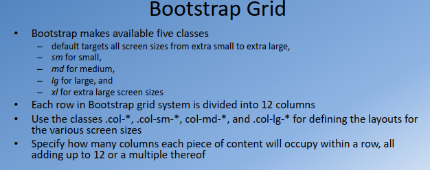

This is a course on Cousera: [Full-Stack Web Development with React](https://www.coursera.org/specializations/full-stack-react).

**Contents**
- [Course 1: Front-End Web UI Frameworks and Tools: Bootstrap 4](#course-1-front-end-web-ui-frameworks-and-tools-bootstrap-4)
  - [Week 1: Front-end Web UI Frameworks Overview: Bootstrap](#week-1-front-end-web-ui-frameworks-overview-bootstrap)
  - [Week 2: Bootstrap CSS Components](#week-2-bootstrap-css-components)
  - [Week 3: Bootstrap Javascript Components](#week-3-bootstrap-javascript-components)
  - [Week 4: Web Tools](#week-4-web-tools)
- [Course 2: Front-End Web Development with React](#course-2-front-end-web-development-with-react)
  - [Week 1: Introduction to React](#week-1-introduction-to-react)
  - [Week 2: React Router and Single Page Applications](#week-2-react-router-and-single-page-applications)
  - [Week 3: React Forms, Flow Architecture and Introduction to Redux](#week-3-react-forms-flow-architecture-and-introduction-to-redux)
  - [Week 4: More Redux and Client-Server Communication](#week-4-more-redux-and-client-server-communication)
- [Course 3: Server-side Development with NodeJS, Express and MongoDB](#course-3-server-side-development-with-nodejs-express-and-mongodb)
  - [Week 1: Introduction to Server-side Development](#week-1-introduction-to-server-side-development)
  - [Week 2: Data, Data, Where art Thou Data?](#week-2-data-data-where-art-thou-data)
  - [Week 3: Halt! Who goes there?](#week-3-halt-who-goes-there)
  - [Week 4: Backend as a Service (BaaS)](#week-4-backend-as-a-service-baas)

## Course 1: [Front-End Web UI Frameworks and Tools: Bootstrap 4](https://www.coursera.org/learn/bootstrap-4?specialization=full-stack-react)

### Week 1: Front-end Web UI Frameworks Overview: Bootstrap

This week gives you:
- quick introduction to full-stack web development
- outline of the course
- basics of Bootstrap
- responsive design and the Bootstrap grid system

**What I learnt:**

1. full-stack web development
    <p align="center">
    
    </p>
2. Basic Git Commands
3. Including meta tags and js libraries
   ```html
    <!-- Required meta tags always come first -->
        <meta charset="utf-8">
        <meta name="viewport" content="width=device-width, initial-scale=1, shrink-to-fit=no">
        <meta http-equiv="x-ua-compatible" content="ie=edge">
     
        <!-- Bootstrap CSS -->
        <link rel="stylesheet" href="node_modules/bootstrap/dist/css/bootstrap.min.css">`
   ```
4. Bootstrap Grid
    <p align="center">
    
    </p>
5. CSS

### Week 2: Bootstrap CSS Components

This week gives you:
- Navigation and Navigation bar
- buttons, forms, tables, cards, images and media, tags, alerts and progress bars

**What I learnt:**

1. Navbar
   <p align="center">
    
    </p>
2. Breadcrumbs
   <p align="center">
    
    </p>
3. Icon Fonts
   - Font Awesome
   - Bootstrap-social

     `<i class="fa fa-phone fa-lg"></i>`
4. Buttons
   <p align="center">
    
    </p>
5. Forms
   <p align="center">
    
    </p>
6. Tables
   <p align="center">
    
    </p>
7. Cards
   <p align="center">
    
    </p>
8.  Bootstrap card with quotation
   <p align="center">
    
    </p>
9.  Image, Media, Badge
    <p align="center">
    
    </p>

### Week 3: Bootstrap Javascript Components

This week gives you:
- Bootstrap's JavaScript based components
- tabs, pills and tabbed navigation, collapse, accordion, scrollspy, affix, tooltips, popovers, modals and the carousel

**What I learnt:**

1. Bootstrap's JavaScript support is through JS plugins
   - Plugins written based on JQuery
2. Tabbed navigation
   <p align="center">
    
    </p>
3. Collapse and Accordion
   <p align="center">
    
    </p>
4. Modal and Form
   <p align="center">
    
    </p>
5. Carousel with Control Button
   <p align="center">
    
    </p>

### Week 4: Web Tools

This week gives you:
- Bootstrap JavaScript components
- CSS preprocessors, Less and Sass
- Building and deployment: NPM scripts, Grunt and Gulp

**What I learnt:**

1. Bootstrap and JQuery
   <p align="left">
    
    
    
    
    </p>
2. CSS preprocessors, Less and Sass
   <p align="left">
    
    
    
    
    
    
    
    
    </p>
3. NPM scripts
4. Grunt and Gulp

## Course 2: [Front-End Web Development with React](https://www.coursera.org/learn/front-end-react?specialization=full-stack-react)

### Week 1: Introduction to React

In this module we get a quick introduction to front-end JavaScript frameworks and libraries, followed by an introduction to React. We will also learn about React components and JSX.

### Week 2: React Router and Single Page Applications

In this week, you will learn about various component types. You will learn about React router and its use in designing single page applications. You will also learn about single page applications and use React Router to design single page applications.

### Week 3: React Forms, Flow Architecture and Introduction to Redux

In this module you will be introduced to uncontrolled and controlled forms and briefly examine form validation in React applications. You will get an overview of the Flux architecture and introduced to Redux as a way of realizing the flux architecture

### Week 4: More Redux and Client-Server Communication

In this module you will explore Redux further including Redux action, combining reducers, and Redux thunk, client-server communication using Fetch and the REST API. You will get a brief introduction to animation in React. You will also learn about testing, building and deploying React applications.

## Course 3: [Server-side Development with NodeJS, Express and MongoDB](https://www.coursera.org/learn/server-side-nodejs?specialization=full-stack-react)

### Week 1: Introduction to Server-side Development

In this module you will be introduced to Node, Node modules and the Node HTTP server. You will learn about the Express framework and how to set up a REST API using Express.

### Week 2: Data, Data, Where art Thou Data?

This module looks in detail at data storage with MongoDB, the popular NoSQL database. You will learn first about Express generator for scaffolding an Express application. Then you will learn about MongoDB. You will learn how to interact with MongoDB from a Node application. Then you will learn the Mongoose ODM to create schemas and models, and interact with MongoDB server.

### Week 3: Halt! Who goes there?

This module is dedicated to user authentication. We first develop a full-fledged REST API server with Express, Mongo and Mongoose. Thereafter we examine basic authentication and session-based authentication briefly. We then develop token-based authentication with the support of JSON web tokens and the Passport module.

### Week 4: Backend as a Service (BaaS)

In this module we learn about Mongoose population, a way of cross-referencing documents and populating the documents from other documents. We then review secure communication using HTTPS. We look at Backend as a Service (BaaS) and take a brief look at Loopback.
